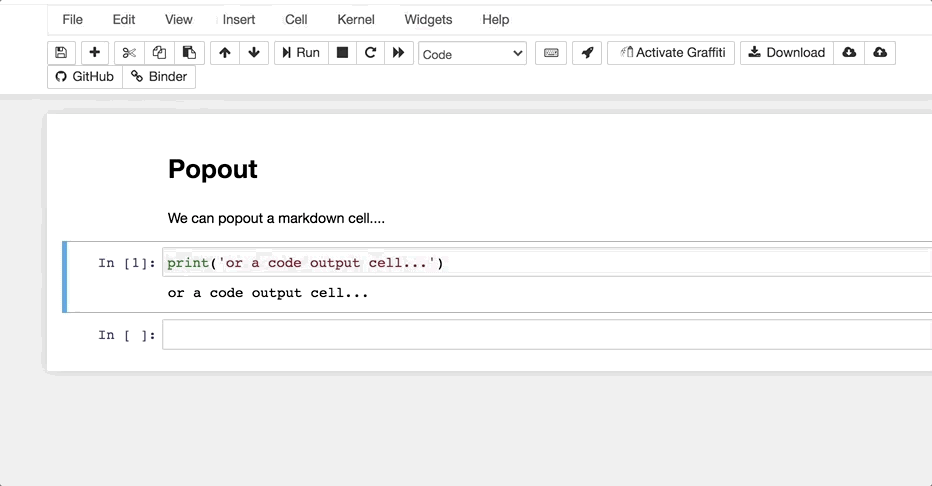

# nb\_cell\_dialog

[](https://mybinder.org/v2/gh/innovationOUtside/nb_cell_dialog/master)

Pop cells into a floating dialog widget from toolbar buttons:



- Rocket button will pop-out markdown and cell output.
- terminal button will pop out code cell and its output. Note: this is non-runnable.

Close the dialog and the cell is put back where it came from (most of the time: I think there's an edge effect if you pop the last cell in the notebook using the terminal button).

Should install automatically.

To install from a copy of this repo:

```
jupyter nbextension uninstall output_dialog/
jupyter nbextension install output_dialog/ --user
jupyter nbextension enable output_dialog/static/index
```

